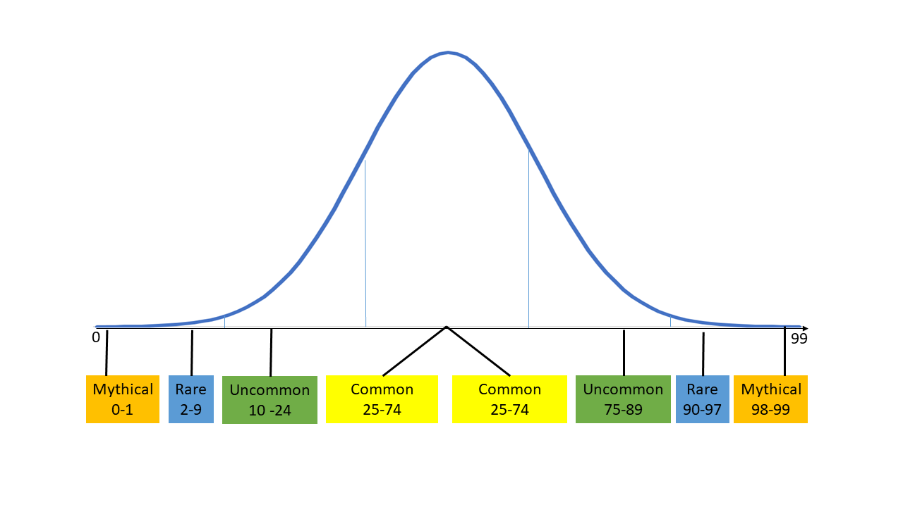

# Traits

## Introduction

Just as you would describe a person as intelligent, strong, or beautiful, you could do the same for Endros. These traits and characteristics define an Endro's identity, what they are good at, and where their weaknesses lie. An Endro's traits influence their [Rarity Scores](traits.md#rarity-scores), appearance, (in-game) performance, and the wearables they are allowed to wear or equip. Traits consist of [Stats](traits.md#stats), [Appearances](traits.md#appearance), [Experience](traits.md#experience), [Zeal ](traits.md#zeal), [Generation ](traits.md#generation)and [Realm](traits.md#classification). They are randomly generated upon indexing, however, it is possible to modify some of them using [Cosmetics](wearables/cosmetics.md), [Chipset Cards](wearables/chipset-cards.md), and [Consumables](consumables.md).

## Randomly Generated Traits

Upon indexing candidates, every blueprint has a number of randomly generated traits, with the randomness proven by [ChainLink VRF](https://docs.chain.link/docs/chainlink-vrf/), to construct an Endro. There are two types of these traits.

### Appearance

These stats do not affect the rarity score and are chosen completely random with an equal chance for each one. The don't have any effects on the performance of the Endro in games, or the [Rarity Farming](rarity-farming.md).

### Stats

These are called God-Stats and, they are related to the RPG style of Engaverse. Endros have 6 of them which are listed below:

* Strength - measuring physical power
* Dexterity - measuring agility, balance, coordination and reflexes
* Constitution - measuring endurance, stamina and health
* Mentality - measuring deductive reasoning, cognition, knowledge, memory, rationality, self-awareness, common sense, restraint, perception, and successful planning
* Common-Skills (CS) - measuring charisma, leadership, problem-solving, empathy and, public speaking (shyness)
* Aggressiveness - determination to win or succeed, and the use of bold action as a means to an end.

Their values are on a bell-curve, also known as normal distribution, in range of 0 to 99, and each one is assigned a rarity type of Common, Uncommon, Rare or Mythical depending on their rarity.


Do note that stats are not exactly the same as standard RPG stats; on Engaland, lower stat values are just as valuable as higher stat values. As mentioned earlier, since stats are on a bell-curve, the lowest and the highest values are considered the best, and the middle of the curve is considered the worst. In other words, the further away a stat value is from the middle of the curve is better and more valuable.


Every stat has a minimum value of 50 for its Base Rarity Score aka BRS. The way we compute BRS is based on formula below. Note that BRS value equals to in-game stat that measures the performance of Endros.

```
if randomNumber >= 50 return randomNumber;
else return 99 - randomNumber;
//there is no value lower than 50
```

For example if the generated random number for a stat is 3, then the in-game stat and its respective BRS is 96. In other words, don't think a low value like 0 is bad, on the contrary, it is as good as 99. The chances of getting each stat's rarity type is shown in the table below:

|  Rarity  | Range(L) | Range(H) | Percentage |
| :------: | :------: | :------: | :--------: |
|  Common  |   25-74  |   25-74  |     50%    |
| Uncommon |   10-24  |   75-89  |     30%    |
|   Rare   |    2-9   |   90-97  |     16%    |
| Mythical |    0-1   |   98-99  |     4%     |

Their respective BRS and in-game stat value are also as follows:

|  Rarity  | Range(L) | Range(H) | BRS, In-Game Stat |
| :------: | :------: | :------: | :---------------: |
|  Common  |   25-74  |   25-74  |       50-74       |
| Uncommon |   10-24  |   75-89  |       75-89       |
|   Rare   |    2-9   |   90-97  |       90-97       |
| Mythical |    0-1   |   98-99  |       98-99       |


As you can see there is no BRS value lower than 50.


The bell curve for stat value distribution looks something like the following:



## Zeal

It defines the level of relationship between the Endro and the owner. It increases or decreases based on how often the owner interacts with the Endro and also how long it has been with the same owner. This trait is not randomly assigned, but rather starts at a fixed value of 50.


Moreover, it acts as a constraint to limit stat modifiers given by chipset cards. Zeal limits the effects of stat modifiers to a range of +/-1 to +/-8.


| Zeal              | Modifiers Low Limit | Modifiers High Limit |
| ----------------- | ------------------- | -------------------- |
| Zeal < -50        | -1                  | +1                   |
| -50 <= Zeal < 0   | -2                  | +2                   |
| 0 <= Zeal < 50    | -3                  | +3                   |
| 50 <= Zeal < 100  | -4                  | +5                   |
| 100 <= Zeal < 150 | -5                  | +5                   |
| 150 <= Zeal < 200 | -6                  | +6                   |
| 200 <= Zeal < 250 | -7                  | +7                   |
| 250 <= Zeal       | -8                  | +8                   |

## Realm

Realms are the classes each Endro belongs to. Each realm has their own unique strengths and weaknesses. On indexing, the realm each Endro candidate belongs to is chosen at random based on a table of probabilities for each realm.

## Experience

Endros can gain experience (XP) in the ways listed below:

* Voting on Enga Federation (ENGADAO)
* Using rare consumables which could be obtaining by participating in raffles
* Playing games

Endros can also be dismissed (burnt) to transfer their experience to another Endro, the percentage of transferable experience is decided by the Enga Federation.

### Level

Once the Endro has enough experience, it can level up. Each level requires more XP compared to the previous one, as a result, leveling up gets tougher gradually.


Each wearable requires a minimum level to be equipped.


### Merit Point

Every one level up, Endros receive an amount of Merit Points that can be used on increasing or decreasing a stat value. Each change to a stat value costs various amounts of Merit Points based on the rarity type of the stat.


As mentioned, sometimes decreasing a trait value can be a good thing. Specifically if the stat value is below 50, then decreasing it results in a greater BRS value. It's always good to move towards to extreme points on the bell-curve.


### Reward Per Leveling Up

Reward calculates as follows:

```
function meritPointRewardPerLevel(level) {
  return 2 + Math.floor(level / 10)
}
```

### Cost Per Stat Update

To update a stat, increasing or decreasing, players must pay merit point based on table below.

|   Rarity | Merit Cost |
| -------: | :--------: |
|   Common |      5     |
| Uncommon |     10     |
|     Rare |     15     |
| Mythical |     30     |

## Generation

To construct an Endro, you need an Opifex Machine to do the process. Those machines come in a limited supply and versions. Enga Federation is in charge of the production of these machines, and they produce them in generations. Which generation your Endro is, could play a role in their other traits. Overall Endros are deflationary, meaning that they are not minted freely, and there is a limit on how many Endros are in a generation.


Some cosmetics may only belong to a specific generation.


## Rarity Score

Rarity Score is a dynamically calculated trait which is based on BRS values of an Endro's stats and cosmetic wearables that the Endro has equipped. The BRS of each stat and cosmetics are then accumulated and form the Rarity Score.


Some wearables, specifically chipset cards, require a minimum rarity score to be equipped or used.

