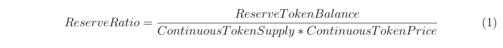

# Bonding Curve

## Introduction

A Bonding Curve is a mathematical curve that defines a relationship between price and token supply. Here’s an example of a bonding curve, where `currentPrice = tokenSupply²`:


The bonding curve says that price increases as the supply of the token increases. In the case of an exponential curve such as the one above, the growth rate accelerates as the number of tokens minted increases.

## How Does It Work?

When a user purchases the token, each subsequent buyer will have to pay a slightly higher price for each token, generating a potential profit for the earliest investors. As the number of the users increases and the buying continues, the value of each token gradually increases alongside the bonding curve. On the other hand, when someone exchanges the bought token back, or in other words, sells the token through TBC (Token Bonding Curve), the sold token will be burnt, and total supply will decrease as well as the price based on a formula.

### Formula

Bonding Curve comes in different shapes. The most notable one is the Bancor formula that relies on a _constant_ **Reserve Ratio** that is calculated as shown below:



```
Reserve Ratio = Reserve Token Balance / (Continuous Token Supply x Continuous Token Price)
```


The **Reserve Ratio** is expressed as a percentage greater than 0% and up to 100%.


The **Reserve Token** refers to the token that users stake into the bonding curve, in this case DAI.

The **Continuous Token** refers to the token that is received from the bonding curve upon staking the Reserve Token, in this case ENGA.

The **Reserve Ratio** represents a fixed ratio between the Continuous Token’s total value (total supply × unit price) and the value of its Reserve Token balance. This ratio will be held constant by the Bancor Formula as both the Reserve Token balance and the Continuous Token’s total value (a.k.a. ‘market cap’) fluctuate with buys and sells.


Since each purchase or sale of a Continuous Token triggers an increase or decrease of Reserve Tokens and Continuous Tokens, the price of the Continuous Token with respect to its Reserve Tokens will continuously recalculate to _maintain_ the configured reserve ratio between them.


The Reserve Ratio determines how sharply a Continuous Token’s price needs to adjust in order to be maintained with every transaction, or in other words, its _price sensitivity_.


The diagram above shows some examples of bonding curves with different Reserve Ratios. In the bottom-left curve with a 10% Reserve Ratio, the price curve grows more aggressively with increasing supply. A Reserve Ratio higher than 10% would flatten towards the linear top-right shape as it approaches 50%.

## What about Engaland

Engaland has a reserve ratio of 33%, as that ratio has proven to be the most effective and sensible. The same reserve ratio was also used in Aavegotchi, and it has been successful in practice.

### Why Bonding Curve

By using TBC, it would be possible to host an AMM (Automated Market Maker) on the dapp, and the need to rely on exchanges and providing liquidity on the exchanges would be eliminated. Although, for the convenience of the community, eventually ENGA will be traded on exchanges as well. More on that in [Arbitrage](https://www.investopedia.com/terms/a/arbitrage.asp).

### Token Supply

As mentioned, by using the bonding curve, the total supply would be dynamic. When investors buy ENGA using DAI from the bonding curve, new ENGA tokens are minted and total supply of circulating ENGA would increase. When ENGA tokens are sold back into the bonding curve, the ENGA tokens would be burnt and the seller will receive an equivalent amount in DAI based on the ENGA price on the bonding curve, and the circulating supply of ENGA tokens will decrease. Purchased or sold token amount for buy and sell respectively calculates as follows:

#### Buy Formula

```
ENGA_PurchaseReturn = ENGA_TotalSupply * ((1 + paidUSD / USD_ReserveBalance) ^ (ReserveRatio) - 1)
```

#### Sell Formula

```
USD_SaleReturn = USD_ReserveBalance * (1 - (1 - paidEnga/ ENGA_TotalSupply ) ^ (1 / (ReserveRatio)))
```
